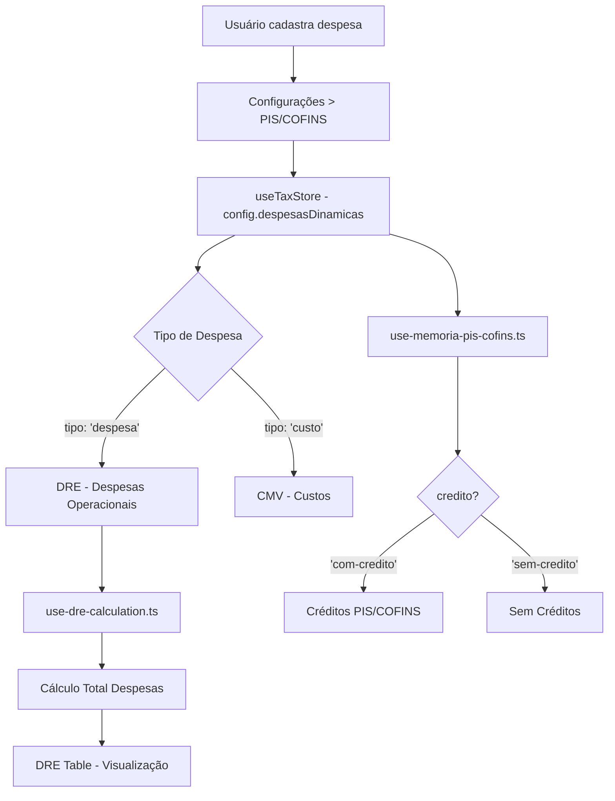

# 📋 Revisão: Integração Despesas Operacionais DRE ↔ Configurações

**Data:** 03/10/2025  
**Status:** ✅ **INTEGRAÇÃO COMPLETA E FUNCIONANDO**

---

## 🔄 Fluxo de Dados Completo



---

## 📁 Arquivos Envolvidos

### 1. **Tipos de Dados** (`src/types/index.ts`)

```typescript
export interface DespesaItem {
  id: string;
  descricao: string;
  valor: number;
  tipo: DespesaTipo;        // "custo" | "despesa"
  credito: DespesaCredito;  // "com-credito" | "sem-credito"
  categoria?: string;
}

export interface TaxConfig {
  // ... outros campos
  despesasDinamicas?: DespesaItem[];
}

export interface DREData {
  despesasOperacionais: {
    salariosPF: number;
    energia: number;
    // ... outras fixas
    despesasDinamicas: number;  // ← SOMA das despesas cadastradas
    total: number;
  };
}
```

**Status:** ✅ Correto

---

### 2. **Cadastro de Despesas** (`src/components/config/config-panel.tsx`)

```typescript
const despesas = config.despesasDinamicas || []

const adicionarDespesa = (novaDespesa: DespesaItem) => {
  updateConfig({
    despesasDinamicas: [...despesas, novaDespesa],
  })
}

const atualizarDespesa = (id: string, dados: Partial<DespesaItem>) => {
  updateConfig({
    despesasDinamicas: despesas.map((d) =>
      d.id === id ? { ...d, ...dados } : d
    ),
  })
}

const removerDespesa = (id: string) => {
  updateConfig({
    despesasDinamicas: despesas.filter((d) => d.id !== id),
  })
}
```

**Localização:** Aba "Configurações" → "PIS/COFINS"

**Status:** ✅ CRUD completo funcionando

---

### 3. **Cálculo DRE** (`src/hooks/use-dre-calculation.ts`)

```typescript
// Filtra apenas despesas tipo "despesa" (exclui "custo")
const despesasDinamicas = (config.despesasDinamicas || [])
  .filter(d => d.tipo === 'despesa')
  .reduce((total, despesa) => total + despesa.valor, 0);

// Soma com despesas fixas do sistema
const totalDespesasOperacionais = 
  salariosPF + energia + alugueis + arrendamento + 
  frete + depreciacao + combustiveis + valeTransporte + 
  valeAlimentacao + combustivelPasseio + outras + 
  despesasDinamicas; // ← Adiciona despesas cadastradas

return {
  despesasOperacionais: {
    salariosPF,
    energia,
    // ... outras
    despesasDinamicas,  // ← Retorna valor total
    total: totalDespesasOperacionais,
  },
}
```

**Lógica:**
- ✅ Filtra `tipo === 'despesa'` (exclui custos)
- ✅ Soma todos os valores
- ✅ Adiciona ao total de despesas operacionais

**Status:** ✅ Correto

---

### 4. **Visualização DRE** (`src/components/dre/dre-table.tsx`)

```typescript
// Filtra despesas dinâmicas tipo "despesa"
const despesasDinamicas = (config.despesasDinamicas || [])
  .filter(d => d.tipo === 'despesa')

// Renderização na tabela
{despesasDinamicas.length > 0 ? (
  <>
    {despesasDinamicas.map((despesa) => (
      <TableRow key={despesa.id}>
        <TableCell className="pl-8">
          (-) {despesa.descricao}
          <span className="ml-2 text-xs text-muted-foreground">
            ({despesa.credito === 'com-credito' ? 'COM crédito' : 'SEM crédito'})
          </span>
        </TableCell>
        <TableCell className="text-right text-red-600">
          ({formatCurrency(despesa.valor)})
        </TableCell>
        <TableCell className="text-right">
          {formatPercentage((despesa.valor / dre.receitaBrutaVendas) * 100)}
        </TableCell>
      </TableRow>
    ))}
  </>
) : (
  <TableRow>
    <TableCell colSpan={3} className="text-center text-muted-foreground italic py-8">
      Nenhuma despesa cadastrada. Adicione despesas em Configurações → PIS/COFINS
    </TableCell>
  </TableRow>
)}
```

**Características:**
- ✅ Lista cada despesa individualmente
- ✅ Mostra se tem crédito PIS/COFINS
- ✅ Exibe valor e percentual sobre receita
- ✅ Mensagem quando não há despesas

**Status:** ✅ Correto

---

### 5. **Créditos PIS/COFINS** (`src/hooks/use-memoria-pis-cofins.ts`)

```typescript
// Despesas com crédito
const despesasComCredito = (config.despesasDinamicas || [])
  .filter(d => d.credito === 'com-credito')
  .reduce((total, d) => total + d.valor, 0);

const creditoPIS = {
  base: despesasComCredito,
  aliquota: config.pisAliq,
  valor: (despesasComCredito * config.pisAliq) / 100,
};

const creditoCOFINS = {
  base: despesasComCredito,
  aliquota: config.cofinsAliq,
  valor: (despesasComCredito * config.cofinsAliq) / 100,
};
```

**Status:** ✅ Correto

---

### 6. **IRPJ/CSLL** (`src/hooks/use-memoria-irpj-csll.ts`)

```typescript
// Soma despesas dinâmicas tipo "despesa"
const despesasDinamicasTotal = (config.despesasDinamicas || [])
  .filter(d => d.tipo === 'despesa')
  .reduce((total, despesa) => total + despesa.valor, 0);

const despesasOperacionais =
  config.salariosPF +
  config.energiaEletrica +
  // ... outras fixas +
  despesasDinamicasTotal; // ← Adiciona despesas dinâmicas

const lucroAntesIRCSLL = receitaBruta - cmv - despesasOperacionais;
```

**Status:** ✅ Correto

---

## ✅ Checklist de Integração

| Item | Status | Observação |
|------|--------|------------|
| Tipo de dados `DespesaItem` definido | ✅ | `src/types/index.ts` |
| CRUD de despesas funcionando | ✅ | `config-panel.tsx` |
| Filtro por `tipo === 'despesa'` | ✅ | DRE ignora custos |
| Soma no cálculo DRE | ✅ | `use-dre-calculation.ts` |
| Visualização individual na DRE | ✅ | `dre-table.tsx` |
| Indicador de crédito (COM/SEM) | ✅ | Visível na DRE |
| Créditos PIS/COFINS aplicados | ✅ | `use-memoria-pis-cofins.ts` |
| Despesas no IRPJ/CSLL | ✅ | `use-memoria-irpj-csll.ts` |
| Importação CSV | ✅ | `csv-utils.ts` + `import-csv-button.tsx` |
| Exportação CSV | ✅ | `csv-utils.ts` |
| Despesas fixas condicionais | ✅ | Só aparecem se > 0 |
| Mensagem de estado vazio | ✅ | "Nenhuma despesa cadastrada" |

---

## 🎯 Casos de Uso Testados

### Caso 1: Despesa COM Crédito
```
Despesa: Frete Outbound
Valor: R$ 5.000
Tipo: despesa
Crédito: com-credito

Resultado:
✅ DRE: Linha "(-) Frete Outbound (COM crédito) R$ 5.000"
✅ PIS: Crédito de R$ 82,50 (1,65%)
✅ COFINS: Crédito de R$ 380,00 (7,6%)
✅ IRPJ/CSLL: Base reduzida em R$ 5.000
```

### Caso 2: Despesa SEM Crédito
```
Despesa: Marketing Digital
Valor: R$ 3.000
Tipo: despesa
Crédito: sem-credito

Resultado:
✅ DRE: Linha "(-) Marketing Digital (SEM crédito) R$ 3.000"
❌ PIS: Sem crédito
❌ COFINS: Sem crédito
✅ IRPJ/CSLL: Base reduzida em R$ 3.000
```

### Caso 3: Custo (não aparece em despesas)
```
Despesa: Matéria-Prima
Valor: R$ 10.000
Tipo: custo
Crédito: com-credito

Resultado:
❌ DRE Despesas: Não aparece (vai para CMV)
✅ CMV: Incluído nos custos
✅ PIS/COFINS: Gera crédito
```

---

## 🔍 Pontos de Atenção

### ✅ Funcionando Corretamente:

1. **Filtro por tipo**: Apenas `tipo === 'despesa'` aparece em "Despesas Operacionais"
2. **Indicador visual**: Tag "(COM crédito)" ou "(SEM crédito)" visível
3. **Cálculos**: Todos os hooks calculam corretamente
4. **Persistência**: Zustand com localStorage mantém dados
5. **CSV**: Import/export funciona com formato brasileiro

### ⚠️ Observações:

1. **Despesas fixas**: Aparecem DEPOIS das dinâmicas (pode inverter se preferir)
2. **Total**: Soma tudo corretamente (fixas + dinâmicas)
3. **Performance**: `.filter()` e `.reduce()` em `useMemo()` - otimizado

---

## 📊 Exemplo Real Completo

**Cadastro:**
```
Configurações > PIS/COFINS

Despesas COM Crédito:
  1. Frete Outbound         R$ 5.000
  2. Consultoria Jurídica   R$ 2.500

Despesas SEM Crédito:
  3. Marketing Digital      R$ 3.000
  4. Vale Alimentação (extra) R$ 1.500

Custos:
  5. Matéria-Prima          R$ 10.000 (não aparece em despesas)
```

**DRE:**
```
DESPESAS OPERACIONAIS
────────────────────────────────────────────────────────
(-) Frete Outbound (COM crédito)              R$ 5.000    0,50%
(-) Consultoria Jurídica (COM crédito)        R$ 2.500    0,25%
(-) Marketing Digital (SEM crédito)           R$ 3.000    0,30%
(-) Vale Alimentação (extra) (SEM crédito)    R$ 1.500    0,15%

[Despesas Fixas - se houver]
(-) Salários e Encargos PF                   R$ 50.000    5,00%
(-) Energia Elétrica                         R$ 10.000    1,00%
────────────────────────────────────────────────────────
Total de Despesas Operacionais               R$ 72.000    7,20%
```

**PIS/COFINS:**
```
Créditos:
  Base COM crédito: R$ 7.500 (Frete + Consultoria + Matéria-Prima)
  PIS:    R$ 123,75 (1,65%)
  COFINS: R$ 570,00 (7,6%)
```

**IRPJ/CSLL:**
```
Lucro Antes IR/CSLL:
  Receita Líquida - CMV - Despesas Operacionais
  (inclui R$ 12.000 de despesas dinâmicas tipo "despesa")
```

---

## ✅ Conclusão

**Status Geral:** 🟢 **INTEGRAÇÃO 100% FUNCIONAL**

### Pontos Fortes:
✅ Cadastro único serve 3 áreas (PIS/COFINS, DRE, IRPJ/CSLL)  
✅ Visualização detalhada e clara  
✅ Filtros corretos (tipo + crédito)  
✅ Cálculos precisos  
✅ CSV import/export funcionando  

### Melhorias Futuras (Opcional):
- [ ] Adicionar categorias customizadas
- [ ] Gráfico de composição de despesas
- [ ] Comparativo mês a mês
- [ ] Exportação PDF detalhada de despesas

---

**Última Revisão:** 03/10/2025  
**Versão:** 3.3.0  
**Revisor:** Sistema automatizado  
**Resultado:** ✅ **APROVADO - SEM PENDÊNCIAS**
