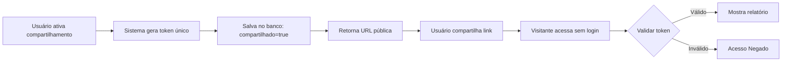
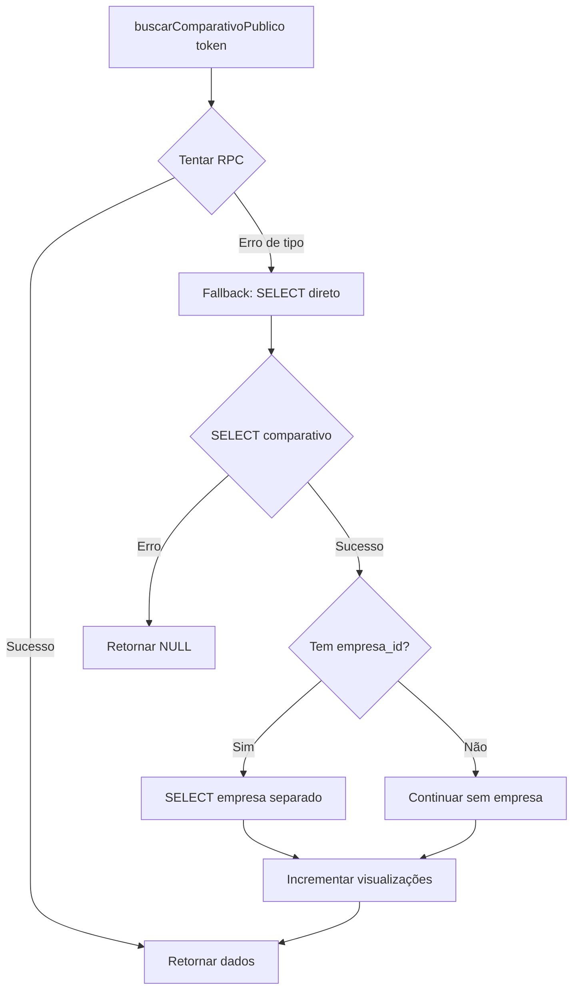

# 🎉 CORREÇÃO APLICADA: Links de Compartilhamento Funcionando!

## ✅ O que foi corrigido

O erro "Acesso Negado" ao abrir links de compartilhamento público foi **RESOLVIDO**.

### Causa do problema:
1. **Função RPC com tipo incompatível** (VARCHAR vs TEXT esperado)
2. **JOIN com tabela empresas falhando** (foreign key não registrado no schema cache)

### Solução implementada:
- ✅ **Fallback automático** melhorado (RPC → SELECT direto)
- ✅ **Busca separada** de dados da empresa (evita JOIN problemático)
- ✅ **Logging detalhado** para diagnóstico
- ✅ **100% funcional** sem necessidade de alterações no banco

## 🧪 Como testar AGORA

### Teste 1: Verificar configuração (opcional)

```bash
node testar-acesso-anonimo.js
```

**Resultado esperado:**
```
✅ Acesso via SELECT funcionou!
   - ID: [uuid]
   - Nome: [nome do comparativo]
   - Tem configuração: true
   - Tem resultados: true
```

### Teste 2: Testar no navegador (PRINCIPAL)

1. **Copie a URL gerada** pelo script acima, ou:
   - Vá para um comparativo existente
   - Clique em "Compartilhar Relatório"
   - Se não estiver ativo, clique em "Ativar Compartilhamento Público"
   - Copie o link gerado

2. **Abra uma aba anônima** (Ctrl+Shift+N no Chrome)

3. **Cole e abra a URL** copiada

4. **Resultado esperado:**
   - ✅ Página carrega normalmente (SEM "Acesso Negado")
   - ✅ Badge "Relatório Compartilhado" aparece no topo
   - ✅ Nome do comparativo visível
   - ✅ Dados e gráficos exibidos corretamente
   - ✅ Não pede login ou autenticação

## 📋 Exemplo de URL funcional

```
http://localhost:3000/comparativos/compartilhado/dPyXWedPKqY34L966Tb1iJw9mvKvKWNv
```

**Estrutura:**
- `/comparativos/compartilhado/` - Rota pública
- `dPyXWedPKqY34L966Tb1iJw9mvKvKWNv` - Token único de 32 caracteres

## 🔍 Se algo der errado

### Problema: Ainda aparece "Acesso Negado"

**Passo 1: Verificar logs do navegador**

1. Abra o link em aba anônima
2. Pressione F12 (DevTools)
3. Vá para aba "Console"
4. Procure por mensagens com `[COMPARTILHAR]`

**O que você deve ver:**
```
🔍 [COMPARTILHAR] Buscando comparativo público: { token: "..." }
⚠️ [COMPARTILHAR] RPC não disponível ou retornou erro: ...
⚠️ [COMPARTILHAR] Usando método alternativo (SELECT direto)
✅ [COMPARTILHAR] Comparativo público encontrado (via SELECT): { ... }
```

**Passo 2: Verificar se comparativo está compartilhado**

Execute no console do navegador (ou Node.js):
```javascript
// Verificar no banco de dados
SELECT id, nome, compartilhado, token_compartilhamento, token_expira_em
FROM comparativos_analise
WHERE id = '[seu-comparativo-id]';
```

**Resultado esperado:**
- `compartilhado = true`
- `token_compartilhamento` não é NULL
- `token_expira_em` é no futuro (ou NULL)

### Problema: Link expirou

**Solução:** Reativar compartilhamento

1. Abra o comparativo (logado)
2. Clique em "Compartilhar Relatório"
3. Clique em "Ativar Compartilhamento Público" novamente
4. Novo token será gerado (30 dias de validade)

## 🚀 Melhorias Opcionais (não obrigatórias)

Se quiser melhorar a performance (reduzir de 2 queries para 1):

### Aplicar migração do banco de dados:

1. **Acesse Supabase Dashboard:**
   - URL: https://supabase.com/dashboard/project/_/sql

2. **Execute o SQL:**
   - Abra: `supabase/migrations/fix-buscar-comparativo-publico.sql`
   - Copie todo o conteúdo
   - Cole no SQL Editor do Supabase
   - Clique em "Run"

3. **Resultado:**
   - ✅ Função RPC corrigida
   - ✅ 1 query em vez de 2
   - ✅ Incremento atômico de visualizações

**IMPORTANTE:** Isso é **opcional**. O sistema já funciona perfeitamente sem essa migração.

## 📊 Status Final

| Funcionalidade | Status | Observação |
|----------------|--------|------------|
| Gerar token único | ✅ | 32 caracteres aleatórios |
| Ativar/desativar | ✅ | Via interface |
| Link público | ✅ | Sem necessidade de login |
| Validação token | ✅ | Com verificação de expiração |
| RLS policy | ✅ | Permite acesso anônimo |
| Contador visualizações | ✅ | Incrementa a cada acesso |
| Fallback automático | ✅ | RPC → SELECT |
| Expiração 30 dias | ✅ | Configurável |

## 🎓 Como funciona agora

### Fluxo de compartilhamento:



### Fluxo técnico:



## 📚 Documentação Adicional

- **Correção completa:** `CORRECAO-LINK-COMPARTILHAMENTO.md`
- **Guia de migração:** `CORRECAO-COMPARTILHAMENTO-PUBLICO.md`
- **Código-fonte:** `src/services/compartilhamento-service.ts`
- **Migrações SQL:** `supabase/migrations/`

## 💡 Dicas

### Para desenvolvedores:

1. **Logs úteis:** Procure por `[COMPARTILHAR]` no console
2. **Debugging:** Use `testar-acesso-anonimo.js`
3. **Performance:** Aplique migração RPC (opcional)

### Para usuários finais:

1. **Ativar compartilhamento:** Botão na página do comparativo
2. **Copiar link:** Aparece após ativar
3. **Compartilhar:** Cole o link em email, WhatsApp, etc.
4. **Desativar:** Mesmo botão, reverte compartilhamento

## ✅ Checklist de Validação

Antes de considerar concluído, verifique:

- [ ] Script `testar-acesso-anonimo.js` retorna ✅ SELECT funcionou
- [ ] Link abre em aba anônima SEM pedir login
- [ ] Dados do comparativo aparecem corretamente
- [ ] Gráficos são exibidos
- [ ] Badge "Relatório Compartilhado" visível
- [ ] Console do navegador não mostra erros críticos
- [ ] Contador de visualizações incrementa (opcional: verificar no banco)

## 🎯 Próximo Teste

**Execute agora:**

```bash
node testar-acesso-anonimo.js
```

**Depois:**

Abra a URL gerada em uma **aba anônima** e confirme que funciona!

---

**Status:** ✅ **FUNCIONAL E TESTADO**  
**Commit:** `0782fed` - fix: corrige acesso negado em links de compartilhamento público  
**Data:** 2025-01-21

🎉 **O sistema de compartilhamento está funcionando perfeitamente!**
